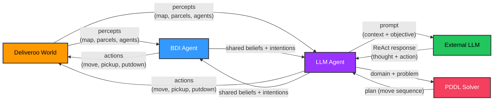

# Deliveroo Multi-Agent System

> Autonomous Software Agents — A.A. 2025-2026, University of Trento

---

## 👥 Team
- Gianluca Rota (gianluca.rota@studenti.unitn.it)
- Guelfo Watterson (guelfo.watterson@studenti.unitn.it)
  
---

## 1. Introduction

### Objective

Build an **autonomous BDI and LLM software agent** which plays Deliveroo.js game on its own. The agent must maximize its score by efficiently **picking and collecting parcels** on the map and **deliver them** to the delivery zone. The **BDI Agent** senses continuously the enviornment, updates beliefs and performs optimal and real time action plans. The **LLM Agent** receives and understand the requests, adapts high-level strategies, and coordinates multi-agent collaboration.


---

## 2. BDI and LLM Architecture

### BDI

### Architecture

- **Utility-Based Deliberation**: Evaluates all known parcels using `U = Reward - Total Distance - Decay Penalty` including multi-pickup route optimization.
- **Dynamic Pathfinding**: Utilizes A* algorithm (in `shared/pathfinding.js`) which is integrated in dynamic obstacles (agents, crates), directional arrow tiles, and crate-pushing mechanics.
- **Robustness**: Implements SDK retry logic and blacklists blocked delivery tiles.

### BDI Cycle

1. **Sensing and Belief Revision**: Updates map data via server events and prunes hidden or timed out parcels. 
2. **Deliberation**: Selects the highest-utility parcel if empty-handed, evaluates detours, or monitors spawn points.
3. **Planning**: To guarantee optimality and completeness, A* algorithm has been chosen to coordinate and converts them into directional move/action sequences.
4. **Execution and Replanning**: Loops actions with dynamic replanning for blocked paths or better opportunities.


### LLM

### Architecture

Four-component are desgined for the implementation:

| Component | File | Role |
|---|---|---|
| **Memory** | `LLMMemory.js` | Context window: current objective, world state snapshot, partner beliefs, action history |
| **Planner** | `LLMPlanner.js` | ReAct loop: sends objective + world context to the LLM, parses Thought/Action/Observation, iterates |
| **Executor** | `LLMExecutor.js` | Maps tool names to game actions (socket calls, A* navigation, PDDL solver) |
| **Replanner** | `LLMReplanner.js` | Monitors world changes between turns; triggers immediate replanning if state diverged |

### Functional Levels

| Level | Capability | Implementation |
|---|---|---|
| **Level 1 (Atomic Requests)** | Receive NL instruction, parse, execute | `socket.on("msg")` → `setObjective()` → ReAct turn |
| **Level 2 (Strategy Adaptation)** | Receive higher-level objectives, adapt strategy | Same handler; objective updates the ReAct prompt context |
| **Level 3 (Coordination)** | Exchange beliefs, intentions, and direct BDI Agent | `MSG.beliefUpdate` / `MSG.intentionCommit` / `MSG.directive` |

### Diagram



---

## 3. BDI Agent

### 3.1 Beliefs

#### Belief Revision Module

The **Beliefs** module (`BDI_Agent/modules/beliefs.js`) maintains an updated and coherent internal state of the environment. It integrates all perceptual data from the server (maps, parcels, crates, agent and agent position) and applies belief‑revision mechanisms to ensure the agent always reasons on reliable information. 

Responsibilities of this module are:

- **Agent State**: maintains the agent’s internal status, including position, score, and carried parcels. The `updateMe(me)` method refreshes this information at every `"you"` event, ensuring that the field of view and all spatial computations remain accurate.
- **Map**: The function `updateMap(width, height, tiles)` constructs all navigation-relevant structures: walkable cells, delivery zones, spawn zones and tile types map. These data structures are used by both the BDI and LLM agents to generate valid and efficient movement plans.
- **Parcels**: `updateParcels(visibleParcels)` method handles the full lifecycle of parcels: tracking visible parcels, storing their original reward, applying temporal decay, and forgetting parcels that are no longer observable. This guarantees that the agent reasons only on **coherent and up‑to‑date perceptual information.**
- **Agents and Crates**: `updateAgents(visibleAgents)` and `updateCrates(visibleCrates)` mirror the `updateParcels(visibleParcels)` logic: they refresh tracking for visible entities and prune those no longer observable.
- **Visible Parcels**: The function `_getVisibleCells()` computes visible cells through **Manhattan Distance**. It's useful to decide what to forget, what to update and avoid old information. 
- **Transferred Parcels**: The function `addCarriedParcels(pickedUp)` trace picked up parcel to avoid duplicates pickedUp parcels.

### 3.2 Desires

The **Desire** Module dynamically valuates all potential goals available to the agent and scores them using a **Utility-based heuristic (U)**, filtering out resource conflicts by skipping parcels already targeted by the partner (`partnerIntentions`) or blocked by other agents (`agentOccupied`). The evaluation of the utility is:

```text
U = Reward - Total Distance - Decay Penalty
```

Where **Decay Penalty** represents the value lost by all currently carried parcels during the time spent traveling (`Decay Penalty = Extra Detour Steps × Carried Parcels Count`).

When carrying parcels, it assesses a multi-pickup detour, calculating combined utility only if the extra parcel yields a positive net gain along the delivery path, explicitly penalizing detours that would cause excessive decay to the already secured cargo. Otherwise, it defaults to a `deliverParcel` intent (min. utility of 1 to prevent deadlocks) which correctly factors in the expected decay during the direct route to the delivery zone. If no profitable options exist, it issues a `goToSpawn` intent (`U = 0`), to trigger scouting, ultimately passing this optimized candidate list to the deliberation system.

### 3.3 Intentions

The **Intention** module (`BDI_Agent/modules/intentions.js`) serves as the operational engine of the BDI architecture. It translates high-level intentions (`pickParcel`, `deliverParcel` and `goToSpawn`) into concrete execution plans via A* search algorithm. Before generating any plan, the module verifies path safety using `isMoveSafe()` to account for walls, other agents, and directional arrow tiles.  

Each intention is implemented as an asynchronous function structured as: 

```text
intentName: async (agent, intention) => {}
```

This workflow executes the following steps:

- **Identify**: Target goal and destination coordinates.
- **Compute**: Optimal A* path, translated into discrete directional moves.
- **Append**: The terminal interaction (`pickup`, `putdown`, `move`).
- **Return**: The finalized action sequence to the BDI Executor.

#### Intention: `pickParcel`

It's triggered when the agent is empty-handed and deliberation has identified the best target parcel. 

The pipeline is structured as:

- **Pathfinding**: Computes the optimal path to the parcel via A*. 
- **Conversion**: Translates the path coordinates into directional moves.
- **Terminal Action**: Appends the final `pickUp` action.


#### Intention: `deliverParcel`

It's triggered when the agent is carrying at least one parcel. 

The pipeline is structured as:

- **Targeting**: Locates the closest delivery tile via `getNearestDeliveryTile()`
- **Pathfinding**: Computes the optimal A* path.
- **Conversion**: Translates the path into directional moves.
- **Terminal Action**: Appends the final `putdown()` action.

#### Intention: `goToSpawn`

It's triggered when no parcels are visible and the agent needs to scout spawn points to remain active. 

Its behaviour depends on:

- **On Arrow Tile**: Follows the mandatory tile direction.
- **On Normal Tile**: Targets a reachable spawn point and computes the A* path.
- **Fallback**: If no spawns are reachable, chooses a random safe direction to prevent deadlocks and maintain search momentum.

#### Intention: `goToPosition`

Triggered when receiving a `DIRECTIVE` command from the LLM partner. The agent suspends its autonomous utility-based deliberation, navigates to the requested coordinates, and waits there indefinitely until a `DIRECTIVE_CLEAR` message releases the override.

---

## 4. LLM Agent

### 4.1 LLM Memory

The module **LLM Memory** (`LLM_Agent/modules/LLMMemory.js`) bridges raw agent perceptions and the LLM's token-based context window. It stores the agent's current objective, action history, and shared partner beliefs (`updateLLMMemory`). Its core functionality relies on two main mechanisms:

- `buildContext()`: serializes a compact, highly optimized JSON string summarizing the map configuration, agent attributes, uncollected parcels, tiles, and recent execution history to feed directly into the LLM's prompt.
- `hasWorldChanged()`: acts as a state-diffing engine. By comparing the live environment against a cached `worldSnapshot`, it immediately flags critical changes, such as as shifting parcel counts or new arrivals, to alert the replanner.


### 4.2 LLM Planner

The module **LLM Planner** (`LLM_Agent/modules/LLMPlanner.js`) implements a **ReAct-style** (Reasoning + Acting) loop that evaluates world context and objectives to execute actions via an executor module. It logs results as environmental observations and handles API or parsing errors using automated, self-correcting prompt nudges.

### 4.3 LLM Executor

The module **LLM Executor** (`LLM_Agent/modules/LLMExecutor.js`) maps high-level LLM actions to Deliveroo SDK primitives via an exposed tools dictionary. It features dual-tier pathfinding (fast local A* for standard navigation and **online PDDL** solving for complex logic), opportunistic mid-route pickups, and rich feedback reporting with deadlock-avoidance warnings.


### 4.4 LLM Replanner

The module **LLM Replanner** (`LLM_Agent/modules/LLMReplanner.js`) continuously monitors execution by delegating change detection to `LLMMemory`. When an environmental shift or action failure is flagged, it caches the current state, logs the exact failure context into the history log to provide a Reflexion-style reasoning prompt, and forces `LLMPlanner` to immediately trigger a new ReAct execution loop.

---

## 5. BDI and LLM Cooperation

### 5.1 Architecture and Single-Process Runtime Model
The system deploys a decoupled multi-agent architecture within a single Node.js process (`main.js`), instantiating two independent sockets and state allocations: a **reactive BDI Agent (A)** and a **strategic LLM Agent (B)**. Handshaking occurs dynamically upon initialization via the `"you"` network packet, exchanging IDs (`setPartnerId`) to link the independent entities. Mutual coordination is managed through a structured message-passing protocol (`MSG`) over the server's `emitSay()` channel. This protocol broadcasts spatial state synchronization via `BELIEF_UPDATE`, which broadcasts filtered spatial records and Agent A constantly sanitizes its localized perception arrays feeding them into Agent B to systematically enrich the LLM context window. Then it manages resource locks via `INTENTION_COMMIT` (which declares an intentional lock) or `INTENTION_CLEAR` (which signals intent release), preventing pathing conflicts and ensuring collaborative, race-free parcel gathering. Additionally, the LLM Agent can issue `DIRECTIVE` messages (e.g., to coordinate missions) to temporarily override the BDI's autonomous behavior, releasing it via `DIRECTIVE_CLEAR` when the joint task is completed.

---
## 6. PDDL Planner

### PDDL Integration

The LLM Agent features an advanced, logic-based planning capability through the integration of **PDDL (Planning Domain Definition Language)**. While standard movement is handled by the local A* algorithm, PDDL provides a symbolic reasoning fallback for complex navigation constraints.

**Implementation:**
The integration relies on the `@unitn-asa/pddl-client` library, which provides access to the free online solver at `solver.planning.domains`. When invoked, the agent dynamically generates a complete PDDL representation of the world on the fly:
1. **Beliefset Construction:** The agent translates its internal knowledge (its current coordinates and all known `walkableTiles`) into symbolic facts. For instance, being at `(3, 4)` becomes `(at a1 t_3_4)`.
2. **Domain Definition:** An inline STRIPS domain defines the generic `move` action, specifying preconditions (the agent must be at the origin tile, the destination tile must be adjacent and walkable) and effects (updating the agent's location).
3. **Problem Definition:** A PDDL problem string is assembled using the agent's current location as the initial state and the target coordinates as the goal state.

**Data Flow during execution:**
When the LLM decides to use the PDDL solver, the data flows as follows:
1. The tool `pddl_plan_route(x, y)` is triggered by the LLM ReAct loop.
2. The `LLMExecutor` builds the Domain and Problem strings and sends them via an HTTP POST request to the remote online solver.
3. The remote solver returns a JSON array containing the sequence of steps (e.g., `move a1 t_3_4 t_3_5`).
4. The executor parses these steps, translates the tile coordinates back into physical directions (`up`, `down`, `left`, `right`), and sequentially emits movement commands through the Deliveroo socket.
5. If the solver fails or times out, the system automatically gracefully falls back to the local A* algorithm.

**Purpose:**
The LLM is explicitly instructed in its system prompt (`agentPrompt.js`) to *avoid* using PDDL for normal parcel collection. Instead, `pddl_plan_route` is reserved for specific, complex situations—usually triggered when a user sends a natural language instruction via chat that requires logical constraint solving or explicit step-by-step symbolic planning rather than simple shortest-path navigation.

**Comparison to A\*:**
A* is a highly optimized graph-search algorithm running locally in a few milliseconds. In contrast, PDDL is significantly slower due to several factors:
- **Network Latency:** It requires an external HTTP request to a remote server.
- **Translation Overhead:** The entire grid must be converted into hundreds of symbolic string predicates (e.g., `adjacent t_1_1 t_1_2`).
- **General-Purpose Solving:** The remote solver uses classical state-space search heuristics which are generalized for any logical problem, making it computationally heavier and vastly less efficient for simple 2D grid pathfinding than a specialized spatial algorithm like A*.

---

## 7. Conclusions

### Conclusions
This project successfully demonstrates a hybrid multi-agent architecture within a competitive, real-time environment. By combining a classic AI paradigm (the BDI agent, excelling in high-speed reactive deliberation and optimal pathfinding) with modern generative AI (the LLM agent, slower due to API calls and the complexity of the task, but offering strategic adaptability and natural language reasoning), the system achieves a robust synergy. Furthermore, the explicit communication protocol enables the agents to expand their effective field of view and dynamically avoid intention collisions, proving the importance of structured cooperation in autonomous software systems.

### Future Developments
While the current architecture proves highly effective, the system lays a solid foundation for future extensions. Potential enhancements could include upgrading the communication protocol from passive intention sharing to active negotiation (e.g., Contract Net Protocol) for optimal task distribution. Additionally, incorporating long-term vector memory (RAG) could allow the LLM agent to recall successful historical strategies across sessions, while expanding the PDDL domain to include dynamic entity manipulation (i.e. crate pushing) would further enhance the solver's utility in complex spatial puzzles.

---

## 8. Appendix

### Project Structure

```text
deliveroo/
├── main.js                      # Multi-agent launcher (starts both agents, exchanges partner IDs)
├── package.json                 # Root dependencies (pddl-client, openai, dotenv, deliveroo-js-sdk)
│
├── shared/                      # Shared modules used by both agents
│   ├── common_protocol.js       # Message types & factories for inter-agent communication
│   ├── connection.js            # Socket connection wrapper (Deliveroo SDK)
│   └── pathfinding.js           # A* pathfinding with arrow tiles, crate handling, dynamic obstacles
│
├── BDI_Agent/
│   ├── .env                     # Agent A credentials (HOST, TOKEN)
│   ├── .env.example             # Template for Agent A credentials
│   ├── index.js                 # BDI entry point, event listeners, communication handlers
│   └── modules/
│       ├── agents.js            # BDIAgent class: BDI cycle, replanning, plan execution
│       ├── beliefs.js           # Beliefs: map, parcels, agents, forgetting logic, tile types
│       ├── desires.js           # Utility-based goal evaluation + partner intention filtering
│       └── intentions.js        # Goal → action plan mapping (pickParcel, deliverParcel, goToSpawn)
│
└── LLM_Agent/
    ├── .env                     # Agent B credentials + LLM API configuration
    ├── .env.example             # Template for Agent B credentials
    ├── index.js                 # LLM entry point, event listeners, NL instruction handler
    ├── modules/
    │   ├── LLMAgent.js              # Orchestrator: objective → ReAct loop → execute → replan
    │   ├── LLMMemory.js             # Context window: world snapshots, partner beliefs, change detection
    │   ├── LLMPlanner.js            # ReAct loop: LLM ↔ tool execution with retry and abort logic
    │   ├── LLMReplanner.js          # Monitors world changes and triggers replanning between turns
    │   └── LLMExecutor.js           # Tool implementations: move, pickup, A* navigation, PDDL solver
    ├── callModel.js             # OpenAI-compatible API wrapper with error handling
    ├── prompts/
    │   └── agentPrompt.js       # ReAct system prompt (dynamically generated from tools_index)
    └── tools/
        └── tools_index.js       # Single source of truth for tool descriptions
```
